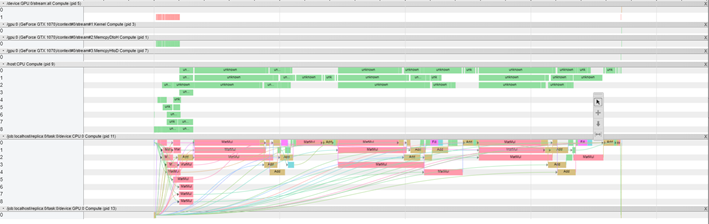

 DGMwTensorFlow
======

[TOC]

*****

### Framework of deep galerkin model (DGM)

* Each DGM layer

### Training function and  Inference function

* Objective function

  

* Target model

  

* Calculation of inference accuracy

### Training Process

* First 10 training epoch

### Inference accuracy and results

* Inference results at 6 given moment in time

  

### Speedup strategies for the Model Inference

(1) **All CPU**

(2) **All GPU**

(3) **Layer 2 - layer 4 on GPU, layer 1 and layer 5  on CPU **

(4) **Results**

### Experimental environment

* **Hardware**

1. AMD Ryzen 5 2600 (6 cores 12 threads)
2. NVIDIA Geforce GTX 1070 (8 GB)
3. 16 GB system RAM

* **Software**

1. Python 3.7.1/ numpy 16.4
2. tensorflow 1.14.0/ tensorflow-gpu 1.14.0
3. cudatoolkit 10.0.13/ cudnn 7.6.0
4. Windows 10

### Reference

[1]  Al-Aradi et al., “Solving Nonlinear and High-Dimensional Partial Differential Equations via Deep Learning,” arXiv:1811.08782v1 [q-fin.CP], 21 Nov 2018.

[2] Justin Sirignano et al., “DGM: A deep learning algorithm for solving partial differential equations,” Journal of Computational Physics 375 (2018) 1339–1364 Contents.

[3] https://zhuanlan.zhihu.com/p/140343833

[4] https://github.com/tensorflow/docs/tree/r1.14/site/en/api_docs/python/tf (API doc)

[5] https://github.com/tensorflow/docs/tree/master/site/en/r1 (official tutorial)

[6] http://deeplearnphysics.org/Blog/index.html 
